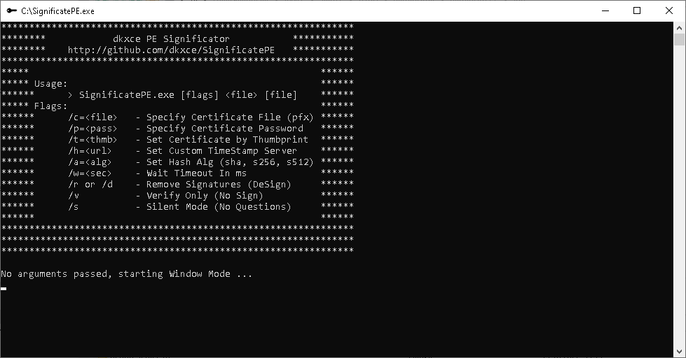
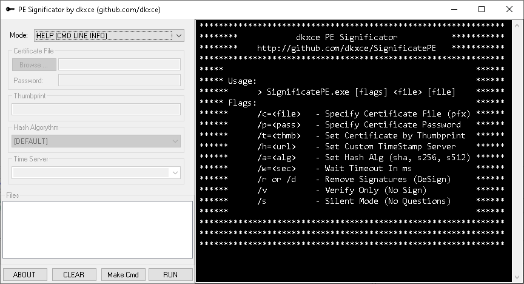

# SignificatePE / Significator

SignificatePE / Significator - Signature Tool for Exe, Dll, MSI (signtool analog)

#### RU ####
**SignificatePE** — это программа, которая подписывает файлы цифровой подписью, проверяет подписи в файлах и удаляет подписи из файлов.    
#### EN ####
**SignificatePE** is a tool that digitally signs files, verifies the signatures in files, and removes signatures from files.      

#### SCREENSHOTS ####
      

**Alternatives**:    
- [MS signtool](https://learn.microsoft.com/ru-ru/windows/win32/seccrypto/signtool) or [info](https://signmycode.com/resources/signing-executable-files-using-microsoft-signtool)       
- [Mac signcode](https://github.com/kevinsawicki/signcode) or [else](https://github.com/InVisionApp/signcode)      
- [Windows ksign](https://www.ksoftware.net/code-signing-certificates/#ksign)
- [WinSign](https://pypi.org/project/winsign/) or [else](https://github.com/mozilla-releng/winsign)
- [signify](https://pypi.org/project/signify/) or [docs](https://signify.readthedocs.io/en/latest/)
- [osslsigncode](https://github.com/theuni/osslsigncode)
- [jsign](https://github.com/ebourg/jsign)
